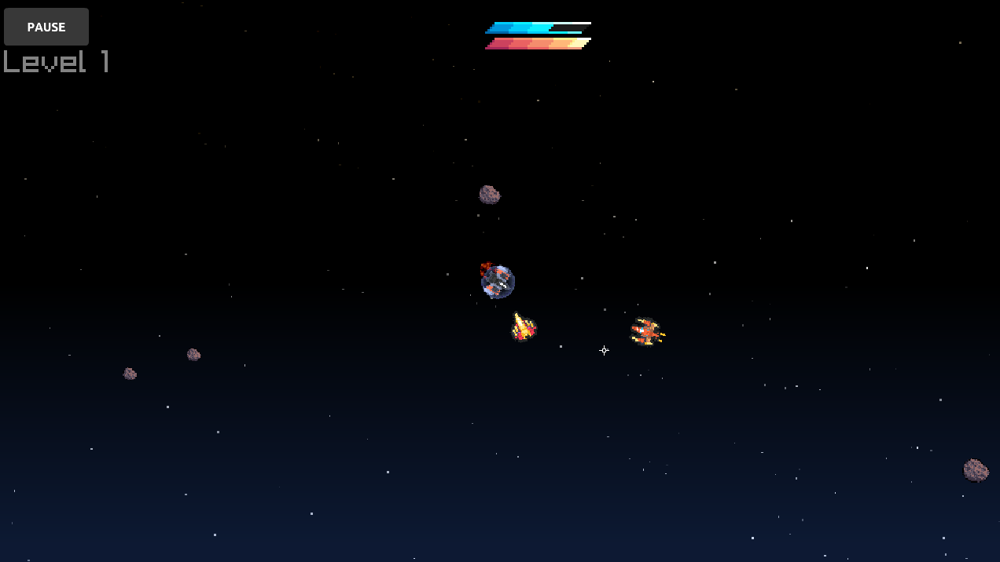
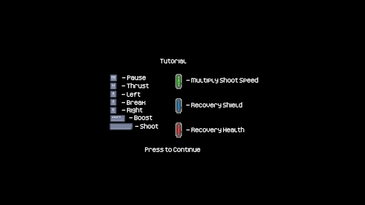
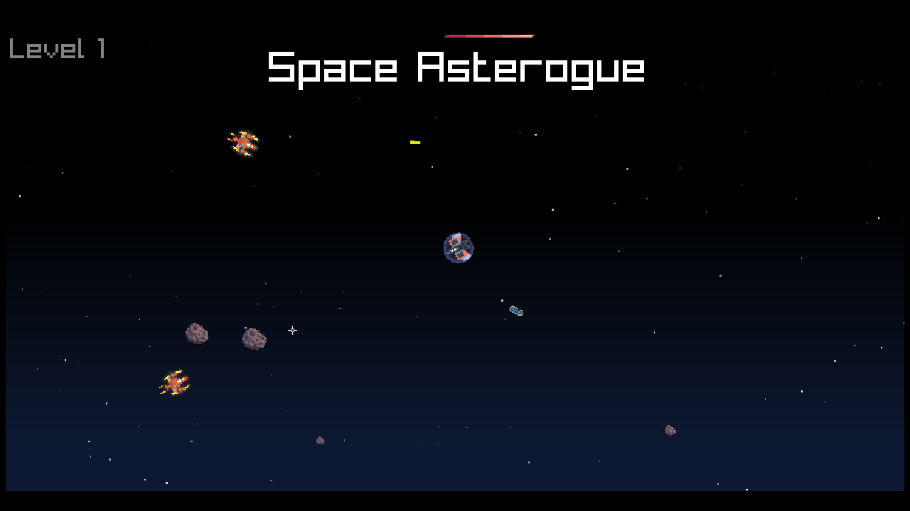

## Space Asterogue

### Description
 Game for Raylib Slo-Jam. Developed with raylib for web and win builds

### Controls
Keyboard:
 - W - thrust
 - A/D - Left/Right control
 - S - Break
 - L Shift - Boost
 - Space - Shoot
 - Esc - Menu
### Libs
 - Raylib [link](https://github.com/raysan5/raylib)
 - Raylib-aseprite [link](https://github.com/RobLoach/raylib-aseprite)

### Assets
 - Airships generated by [Kenney Editor](https://kenney.itch.io/ship-mixer)
 - Asteroids by [foozlecc](https://foozlecc.itch.io/void-environment-pack)
 - Explosion sprites by [ansimuz](https://ansimuz.itch.io/warped-explosion-pack-3)
 - UI bars by [bdragon1727](https://bdragon1727.itch.io/basic-pixel-health-bar-and-scroll-bar)
 - UI pause buttons by [Kenny](https://www.kenney.nl/assets/onscreen-controls)
 - Tutorial UI buttons by [Kenny](https://www.kenney.nl/assets/input-prompts-pixel-16)
 - Font pixel tutorial by [Kenny](https://www.kenney.nl/assets/kenney-fonts)
 - Sound FX by [fallenblood](https://fallenblood.itch.io/50-sfx)
 - Music ambient pattern exported from Vince Kaichan - Visions of a Near Future by OpenMPT

### Links
 - Development timeline: [Youtube](https://youtu.be/xtAKaI6ylKw)
 - itch.io Release: [Play](https://raizr.itch.io/space-asterogue)

### License
This game sources are licensed under an unmodified zlib/libpng license, which is an OSI-certified, BSD-like license that allows static linking with closed source software. Check [LICENSE](LICENSE) for further details.

*Copyright (c) (2024) (raizr) (Denis Pavlenko)*
